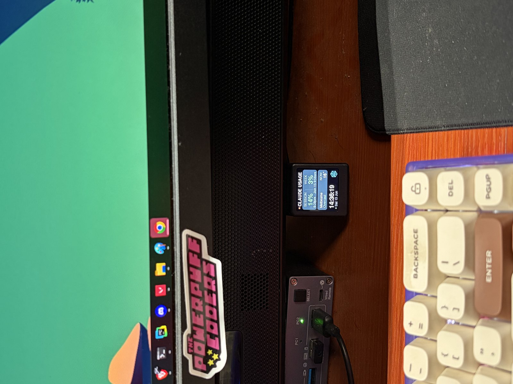
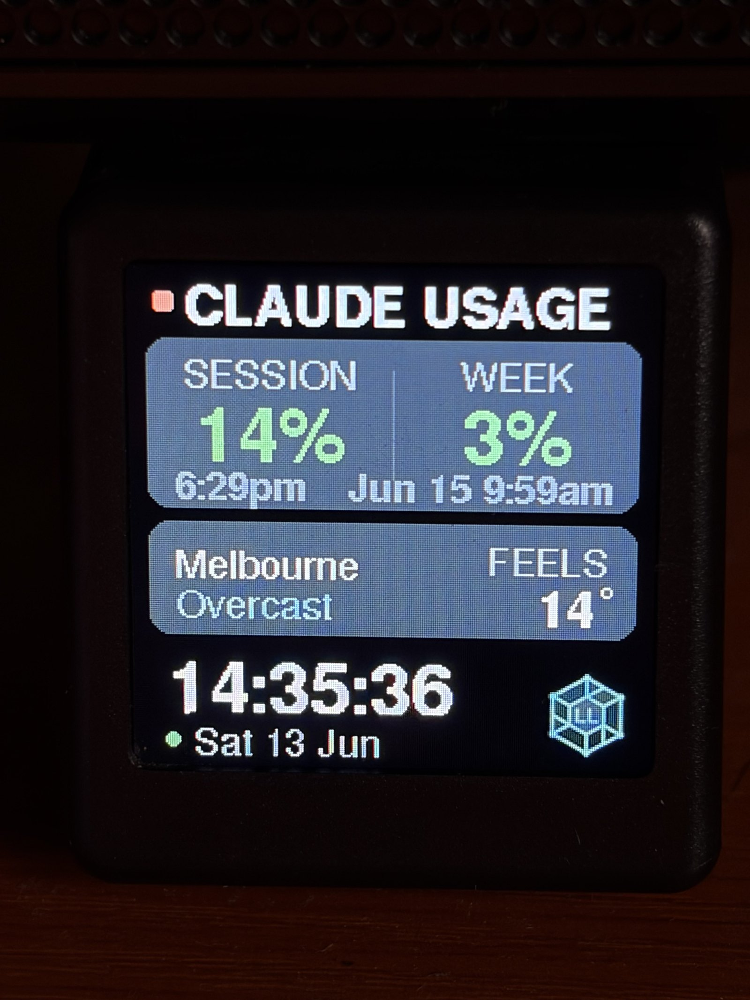

# ClaudeTV

**A tiny desk display that always shows your Claude usage** — the 5‑hour session %, 7‑day
week %, **and your model‑scoped weekly limit (e.g. Fable)** from Claude Code's `/usage`, with
reset times, plus a weather turntable and a clock. Optional **email / Discord / Slack alerts**
when a usage window resets.

It runs on a **$15 WiFi clock** ([GeekMagic SmallTV‑Ultra on AliExpress](https://www.aliexpress.com/item/1005007937948865.html))
that you reflash **over WiFi — no soldering, fully reversible.**

<p align="center"></p>
<p align="center"></p>

> Independent open firmware for the GeekMagic SmallTV‑Ultra (stock firmware:
> [GeekMagicClock/smalltv-ultra](https://github.com/GeekMagicClock/smalltv-ultra)). Hardware ©
> GeekMagic; ClaudeTV firmware © Lattice Labs, MIT. Reflash the stock firmware any time to revert.

---

## What you need

- A **GeekMagic SmallTV‑Ultra** (the **ESP8266** model — [~$15 on AliExpress](https://www.aliexpress.com/item/1005007937948865.html)).
- An **always‑on Linux box** on your LAN (a NAS VM, a Pi, an old laptop) that has **Claude Code
  installed and logged in**. The device can't hold your Claude credentials, so this box reads your
  usage and feeds it to the display over your network — and keeps the auth token fresh for you.

---

## Quick start

### 1 · Set up the host (one command)

On the always‑on box (with Claude Code logged in):

```bash
curl -fsSL https://raw.githubusercontent.com/latticelabs-au/ClaudeTV/main/host/install.sh | bash
```

This installs the **collector + master terminal** as a systemd service (auto‑start, auto‑restart).
When it finishes it prints two URLs — your **master terminal** (`http://<host>:8088/`) and the
**Collector URL** to paste into the device (`http://<host>:8088/usage`).

### 2 · Flash the device (no build)

Grab the prebuilt image from the [latest release](https://github.com/latticelabs-au/ClaudeTV/releases/latest)
and flash it over the clock's stock web updater (find its IP on your router):

```bash
curl -F "firmware=@claudetv-v4.7-generic.bin" http://<device-ip>/update
```

On first boot the device opens a **`ClaudeTV-Setup`** WiFi hotspot. Join it, pick your WiFi, and
paste the **Collector URL** from step 1. Done — it finds your network and the collector and starts
displaying. Afterwards it lives at **`http://claudetv.local/`**.

That's it. Two commands and a WiFi prompt.

---

## How it works

```
 Claude Code (on the always-on host)             ESP8266 clock
        │  keeps the OAuth token fresh                  │
        ▼                                               ▼
  ~/.claude/.credentials.json                    ┌──────────────┐
        │                                         │  ClaudeTV fw │
   collector ─► api.anthropic.com/api/oauth/usage │   /usage  ◄──┼── LAN
   (Python)  ─► open-meteo.com (weather, no key)  └──────────────┘
        │
   http://<host>:8088/usage   ← the device polls this
   http://<host>:8088/        ← master terminal (status, config, token keeper)
```

- **Collector** (`host/claude_usage_server.py`) polls Anthropic's `/api/oauth/usage` (the same
  endpoint Claude Code's `/usage` uses) — session, week, and the model‑scoped weekly limit (read
  generically from `limits[]`, so it follows whatever model Anthropic scopes, Fable today) — plus
  keyless weather from open‑meteo, then serves a small JSON. It **always returns the last‑good
  value** and backs off on rate limits, so the screen never blanks.
- **Token keeper** — the Claude token is short‑lived (~8 h). The collector runs a tiny
  `claude -p "ping" --model haiku` before it expires, which makes **Claude Code refresh its own
  token**. Self‑sustaining; the master terminal shows token status and a manual *Refresh now*.
- **Firmware** (`firmware/claudetv/`) fetches that JSON over your LAN and draws it. Rendering uses
  TFT_eSPI with **one held‑open SPI transaction** (CS stays low, like the stock firmware) so there's
  **no per‑redraw coil/cap tick** — it's silent.

Your Claude token is **never logged, shown, or sent anywhere except `api.anthropic.com`.**

---

## Authentication — one login, self-maintaining

The host authenticates with your **Claude subscription login**, not an API key. Run `claude` once on
the box and `/login` (interactive OAuth); the collector reads that OAuth token from
`~/.claude/.credentials.json`, and the token keeper refreshes it automatically every few hours — so
it runs unattended. You only re-login if the token is **genuinely rejected** (a real 401/403, shown
as **LOGIN EXPIRED** on the device), not for routine operation.

Two things that look like they should work but **don't** — save yourself the detour:

- **API keys (`sk-ant-api…`)** — the `api/oauth/usage` endpoint reports your *subscription* limits
  (5h / 7d / model-scoped), which API-key accounts don't have. Wrong credential entirely.
- **`claude setup-token`** — that long-lived token is scoped for Claude Code *inference* and is
  rejected (**403**) by the usage endpoint. Use the interactive `/login`.

---

## Features

- **Three hero numbers** — S (5h session) | W (7d week) + F (model‑scoped weekly, e.g. **Fable**),
  green/amber/red by level. Week and the scoped limit share one reset line (same 7‑day window);
  accounts without a scoped limit automatically get the classic two‑column card.
- **Reset alerts** — get pinged by **email, Discord, and Slack** the moment a usage window
  (5‑hour session and/or 7‑day week) rolls over to a fresh quota — the reset Anthropic only posts
  on X. Configure it in the master terminal's Notifications card; secrets are write‑only and each
  channel has a Test button.
- **Auth outage on‑screen** — if the host's Claude login dies, the card flips to a red
  **LOGIN EXPIRED / re‑auth on host** state instead of silently showing stale numbers.
- **Weather turntable** — cycles now / feels‑like / high / low / rain % / humidity.
- **Clock** + auto‑dimming **night mode** (default 30 %, 21:00–07:00, configurable).
- **Device control panel** (`http://claudetv.local/`) — brightness, night mode, flip display,
  refresh interval, collector URL, reboot, OTA, and a link to the master terminal.
- **Master terminal** (`http://<host>:8088/`) — live status, **city search** (sets location +
  timezone automatically), token keeper, service control, device link.
- **Emulator** (`emulator/index.html`) — a 240×240 browser preview that pulls live collector data
  and positions text with the **device's real GFX font advance tables**, so string widths match the
  ESP render exactly — tweak the layout without reflashing.

---

## Build from source (optional)

If you'd rather build the firmware yourself instead of using the release image:

1. `cp firmware/claudetv/config.h.example firmware/claudetv/config.h` and fill in your WiFi + the
   collector URL.
2. Copy `firmware/User_Setup.h` over your TFT_eSPI library's `User_Setup.h`.
3. Build with the ESP8266 Arduino core (libs: TFT_eSPI, ArduinoJson, WiFiManager):
   ```bash
   arduino-cli compile --fqbn esp8266:esp8266:generic:eesz=4M1M --output-dir build firmware/claudetv
   ```
4. Flash: `curl -F "firmware=@build/claudetv.ino.bin" http://<device-ip>/update`

To run the collector from a clone instead of the curl installer: `cd host && sudo bash install.sh`.

---

## Hardware (ESP‑12F / ST7789V 240×240)

| Signal | GPIO | | Signal | GPIO |
|---|---|---|---|---|
| MOSI | 13 | | CS | 15 |
| SCLK | 14 | | DC | 0 |
| RST | 2 | | Backlight | 5 (active‑low PWM) |

The stock `/update` endpoint is a plain `ESP8266HTTPUpdateServer`, which is why custom firmware
flashes over the air and the stock firmware re‑flashes the same way. The backlight is PWM'd at
22 kHz — never DC‑drive it at 100 % (it overheats the boost converter).

## License

MIT — see [LICENSE](LICENSE). Built by [Lattice Labs](https://latticelabs.au).
