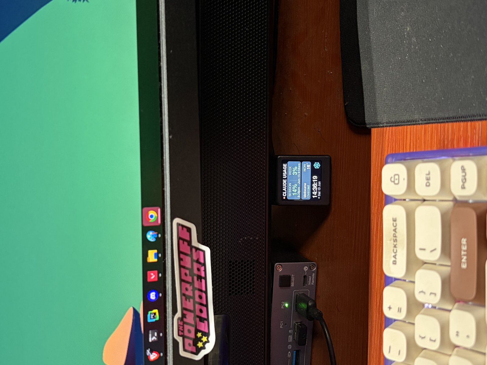
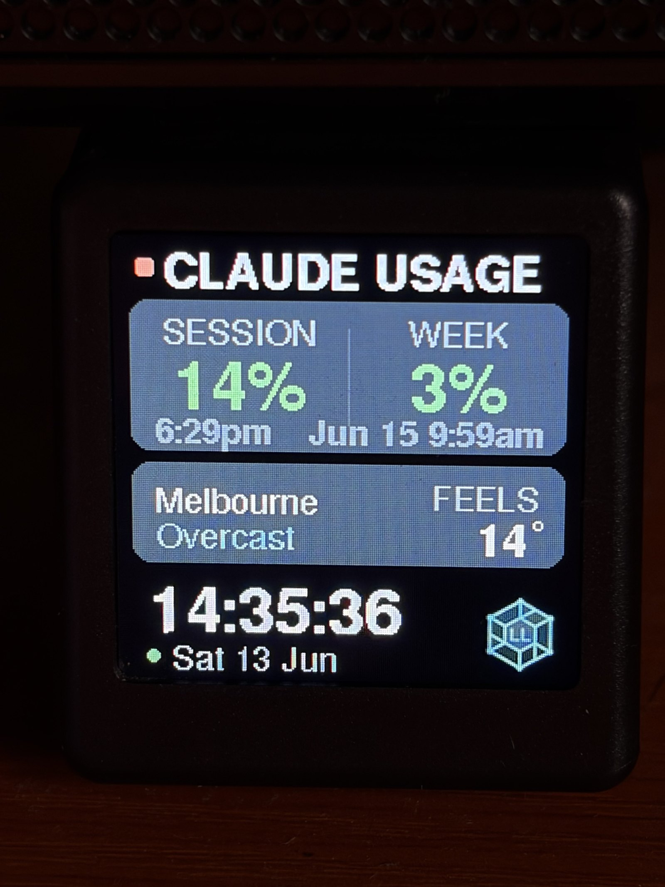

# ClaudeTV

[](https://github.com/latticelabs-au/ClaudeTV/releases/latest)
[](LICENSE)
-1E3A5F?style=flat-square&labelColor=0C1E3C)


**A tiny desk display that always shows your Claude usage** — the 5‑hour session %, 7‑day
week %, **and your model‑scoped weekly limit (e.g. Fable)** from Claude Code's `/usage`, with
reset times, plus a weather turntable and a clock. Optional **email / Discord / Slack alerts**
when a usage window resets.

Got **more than one Claude account**? The display cycles through all of them, each with its own
card and label — see [Multiple accounts](#multiple-accounts).

It runs on a **$15 WiFi clock** ([GeekMagic SmallTV‑Ultra on AliExpress](https://www.aliexpress.com/item/1005007937948865.html))
that you reflash **over WiFi — no soldering, fully reversible.**

<p align="center"></p>
<p align="center"></p>

> Independent open firmware for the GeekMagic SmallTV‑Ultra (stock firmware:
> [GeekMagicClock/smalltv-ultra](https://github.com/GeekMagicClock/smalltv-ultra)). Hardware ©
> GeekMagic; ClaudeTV firmware © Lattice Labs, MIT. Reflash the stock firmware any time to revert.

---

## What you need

- A **GeekMagic SmallTV‑Ultra** (the **ESP8266** model — [~$15 on AliExpress](https://www.aliexpress.com/item/1005007937948865.html)).
- An **always‑on Linux box** on your LAN (a NAS VM, a Pi, an old laptop). The device can't hold
  your Claude credentials, so this box reads your usage and feeds it to the display over your
  network.
- [**claude-swap**](https://github.com/realiti4/claude-swap) (`cswap`) on that box — the
  installer sets it up for you. It holds your Claude logins and keeps their tokens fresh,
  for **one account or a dozen**; ClaudeTV never holds a Claude token itself.
  **Claude Code is not required**: `python3 claude_usage_server.py --login` mints a login on
  a headless box, which `cswap add` then adopts.

---

## Quick start

### 1 · Set up the host (one command)

On the always‑on box:

```bash
curl -fsSL https://raw.githubusercontent.com/latticelabs-au/ClaudeTV/main/host/install.sh | bash
```

If the box doesn't have a logged‑in Claude Code install, authenticate the collector once
(open the printed URL on any device, paste the code back):

```bash
python ~/.claudetv/claude_usage_server.py --login
```

This installs the **collector + master terminal** as a systemd service (auto‑start, auto‑restart).
When it finishes it prints two URLs — your **master terminal** (`http://<host>:8088/`) and the
**Collector URL** to paste into the device (`http://<host>:8088/usage`).

### 2 · Flash the device (no build)

Grab the prebuilt image from the [latest release](https://github.com/latticelabs-au/ClaudeTV/releases/latest)
and flash it over the clock's stock web updater (find its IP on your router):

```bash
curl -F "firmware=@claudetv-v4.7-generic.bin" http://<device-ip>/update
```

On first boot the device opens a **`ClaudeTV-Setup`** WiFi hotspot. Join it, pick your WiFi, and
paste the **Collector URL** from step 1. Done — it finds your network and the collector and starts
displaying. Afterwards it lives at **`http://claudetv.local/`**.

That's it. Two commands and a WiFi prompt.

---

## How it works

```
 always-on host (collector, Python stdlib)             ESP8266 clock
                                                              │
   ┌─ MULTI-ACCOUNT ─────────────────────────┐                ▼
   │  cswap list --json  (claude-swap owns   │        ┌──────────────┐
   │  credentials + token keeping + polling) │        │  ClaudeTV fw │
   └─────────────────────────────────────────┘        │   /usage  ◄──┼── LAN
   ┌─ SINGLE ACCOUNT (fallback, no deps) ────┐        └──────────────┘
   │  credentials file ─► own OAuth keeper   │           cycles acc[]
   │  ─► api.anthropic.com/api/oauth/usage   │
   └─────────────────────────────────────────┘
        │  + open-meteo.com (weather, no key)
        ▼
   http://<host>:8088/usage   ← the device polls this  (?acct=<label> pins one)
   http://<host>:8088/        ← master terminal (accounts, status, config)
```

- **Collector** (`host/claude_usage_server.py`) serves session, week, and the model‑scoped weekly
  limit (read generically from `limits[]`, so it follows whatever model Anthropic scopes, Fable
  today) for **every account**, plus keyless weather from open‑meteo, as one small JSON. It
  **always returns the last‑good value** and backs off on rate limits, so the screen never blanks.
- **Two account backends**, chosen automatically: `cswap` when it's installed with accounts
  (multi‑account, and it owns credentials and token keeping), otherwise the built‑in
  single‑account OAuth keeper below. Nothing to configure either way.
- **Wire format is backwards compatible**: the flat `s`/`w`/`f` keys still carry the first
  account exactly as before, and `acc[]` carries the rest — so a v4.7 device keeps working
  against a multi‑account collector without reflashing.
- **Token keeper** (single‑account mode): the Claude access token is short‑lived (~8 h), but its
  refresh token's ~28‑day validity window **rolls forward on every refresh**. The collector speaks
  the OAuth refresh grant natively (same public‑client endpoint Claude Code uses) and rotates the
  pair itself every few hours, so **one login lasts indefinitely** with no Claude Code install
  needed. The master terminal shows token status and a manual *Refresh now*. In cswap mode this
  keeper **stands fully down** — cswap does the rotating, and two keepers on one token family
  would invalidate each other.
- **Firmware** (`firmware/claudetv/`) fetches that JSON over your LAN and draws it. Rendering uses
  TFT_eSPI with **one held‑open SPI transaction** (CS stays low, like the stock firmware) so there's
  **no per‑redraw coil/cap tick** — it's silent.

Your Claude token is **never logged, shown, or sent anywhere except `api.anthropic.com`.**

---

## Authentication

ClaudeTV holds **no Claude token and runs no OAuth**. [claude-swap](https://github.com/realiti4/claude-swap)
owns your logins, refreshes them, and quarantines any that genuinely die — for one account
exactly as for twelve, so there is only ever one code path and nothing that can drift.

You authenticate with your **Claude subscription login**, not an API key. Two things that
look like they should work but **don't** (save yourself the detour):

- **API keys (`sk-ant-api…`)**: the usage endpoint reports *subscription* limits (5h / 7d /
  model-scoped), which API-key accounts don't have. Wrong credential entirely.
- **`claude setup-token`**: that long-lived token is scoped for Claude Code *inference* and
  is rejected (**403**) by the usage endpoint.

If a login really does die, only that account flips to **LOGIN EXPIRED** on the display and
alerts by name; the others keep showing. Re-register it with `cswap add --alias <name>`.

> ⚠️ **Log in separately on every machine.** Refresh tokens rotate, so if two machines hold
> the *same* login (a `cswap export`/`import`, or a copied credential file) the first one to
> refresh invalidates the other's copy and that account gets quarantined. Anthropic allows
> concurrent logins — do one per box.
---

## Multiple accounts

One account, five, a dozen — all the same path. ClaudeTV reads every account from
[**claude-swap**](https://github.com/realiti4/claude-swap) (`cswap`), which owns credential
storage, token upkeep and per‑account usage polling. With more than one account the device
shows **one at a time and cycles**, so every account keeps the full three‑number card; the
header carries the account label plus page dots (or a compact `3/8` counter past six).

### 1 · Install cswap on the collector host

Any one of these, on the same always‑on box that runs the collector:

```bash
pipx install claude-swap          # recommended
uv tool install claude-swap       # if you use uv
pip install --user claude-swap    # last resort
```

Or let ClaudeTV's own installer put it in a venv beside the collector, no system Python touched:

```bash
CLAUDETV_CSWAP=1 curl -fsSL https://raw.githubusercontent.com/latticelabs-au/ClaudeTV/main/host/install.sh | bash
```

### 2 · Add each account

**For every account**, log in to Claude Code *on that host* as that account, then register it:

```bash
cswap add --alias work            # the alias becomes the display label (first 8 chars)
cswap add --alias personal
cswap add --alias client-a
cswap list                        # confirm they're all there
```

No Claude Code on the box? Mint a login with ClaudeTV's own flow first
(`python3 ~/.claudetv/claude_usage_server.py --login`, which writes
`~/.claude/.credentials.json`), then `cswap add`.

### 3 · That's it

The collector picks cswap up on its next poll — no restart, nothing to configure. Hit **Re‑read
accounts** in the master terminal if you want it immediately.

> ⚠️ **Log in separately on every machine.** Refresh tokens rotate, so if two machines hold the
> *same* login (via `cswap export`/`import`, or a copied credential file) the first one to refresh
> invalidates the other's copy and that account gets quarantined. Anthropic allows concurrent
> logins — do one per box rather than copying credentials between them.

### Managing it from the dashboards

- **Master terminal** (`http://<host>:8088/`) — the **Accounts** card shows the backend and cswap
  version, every account's S/W/scoped numbers, reset times, per‑account age and auth state, an
  inline *How to add an account* guide, a **Re‑read accounts** button, and the account filter.
- **Device panel** (`http://claudetv.local/`) — lists every account with the one currently on
  screen marked, sets **seconds per account**, and has **Show next account now**.

### Details

- **Nothing to configure**: if `cswap` is on PATH (or in `./venv/bin`) and has accounts, the
  collector uses it; otherwise it falls back to the single‑account OAuth keeper below.
- **Pick and order which accounts reach the display** with `CLAUDETV_CSWAP_ACCOUNTS=work,personal`
  (matches alias, email or slot number) — handy when cswap manages more accounts than you want on
  a 240×240 screen. Blank means all of them.
- **cswap owns the credentials** in this mode and ClaudeTV's own token keeper **stands fully
  down**, so the two never rotate the same token family against each other.
- **Per‑account everything**: a dead login takes over only *its* card (`LOGIN EXPIRED`) while the
  others keep showing, alerts are prefixed with the account label, and reset detection is keyed
  per account — so switching accounts can never be mistaken for a usage reset.
- **One device per account instead of cycling?** Point it at `/usage?acct=<label>` — that serves a
  single account, and the header reverts to the classic title.
- The firmware cycles up to **8** accounts (`MAXACC`); the collector itself has no limit.

---

## Features

- **Three hero numbers** — S (5h session) | W (7d week) + F (model‑scoped weekly, e.g. **Fable**),
  green/amber/red by level. Week and the scoped limit share one reset line (same 7‑day window);
  accounts without a scoped limit automatically get the classic two‑column card.
- **Reset alerts** — get pinged by **email, Discord, and Slack** the moment a usage window
  (5‑hour session and/or 7‑day week) rolls over to a fresh quota — the reset Anthropic only posts
  on X. Configure it in the master terminal's Notifications card; secrets are write‑only and each
  channel has a Test button.
- **Auth outage: on‑screen + alerted + self‑healing**: if the Claude login dies the card flips
  to a red **LOGIN EXPIRED / re‑auth on host** state instead of silently showing stale numbers,
  an alert goes out on your configured channels, and if you've set up a standby login the
  collector fails over to it automatically and keeps the display live.
- **Weather turntable** — cycles now / feels‑like / high / low / rain % / humidity.
- **Clock** + auto‑dimming **night mode** (default 30 %, 21:00–07:00, configurable).
- **Device control panel** (`http://claudetv.local/`) — brightness, night mode, flip display,
  refresh interval, collector URL, reboot, OTA, and a link to the master terminal.
- **Master terminal** (`http://<host>:8088/`) — live status, **city search** (sets location +
  timezone automatically), token keeper, service control, device link.
- **In‑app firmware updates** — the master terminal checks GitHub, downloads the release and
  flashes the device over your LAN in one click. The device shows a small cyan marker when an
  update is waiting, so you notice without opening anything. No cable, no manual download.
- **Knows when you are actually blocked** — with auto‑switching, one account capping is a
  non‑event (cswap moves to another). ClaudeTV alerts only when **every** account is out,
  judged against cswap's own `autoswitch.threshold` so the two never disagree.
- **Emulator** (`emulator/index.html`) — a 240×240 browser preview that pulls live collector data
  and positions text with the **device's real GFX font advance tables**, so string widths match the
  ESP render exactly — tweak the layout without reflashing.

---

## Build from source (optional)

If you'd rather build the firmware yourself instead of using the release image:

1. `cp firmware/claudetv/config.h.example firmware/claudetv/config.h` and fill in your WiFi + the
   collector URL.
2. Copy `firmware/User_Setup.h` over your TFT_eSPI library's `User_Setup.h`.
3. Build with the ESP8266 Arduino core (libs: TFT_eSPI, ArduinoJson, WiFiManager):
   ```bash
   arduino-cli compile --fqbn esp8266:esp8266:generic:eesz=4M1M --output-dir build firmware/claudetv
   ```
4. Flash: `curl -F "firmware=@build/claudetv.ino.bin" http://<device-ip>/update`

To run the collector from a clone instead of the curl installer: `cd host && sudo bash install.sh`.

---

## Hardware (ESP‑12F / ST7789V 240×240)

| Signal | GPIO | | Signal | GPIO |
|---|---|---|---|---|
| MOSI | 13 | | CS | 15 |
| SCLK | 14 | | DC | 0 |
| RST | 2 | | Backlight | 5 (active‑low PWM) |

The stock `/update` endpoint is a plain `ESP8266HTTPUpdateServer`, which is why custom firmware
flashes over the air and the stock firmware re‑flashes the same way. The backlight is PWM'd at
22 kHz — never DC‑drive it at 100 % (it overheats the boost converter).

## License

MIT — see [LICENSE](LICENSE). Built by [Lattice Labs](https://latticelabs.au).
